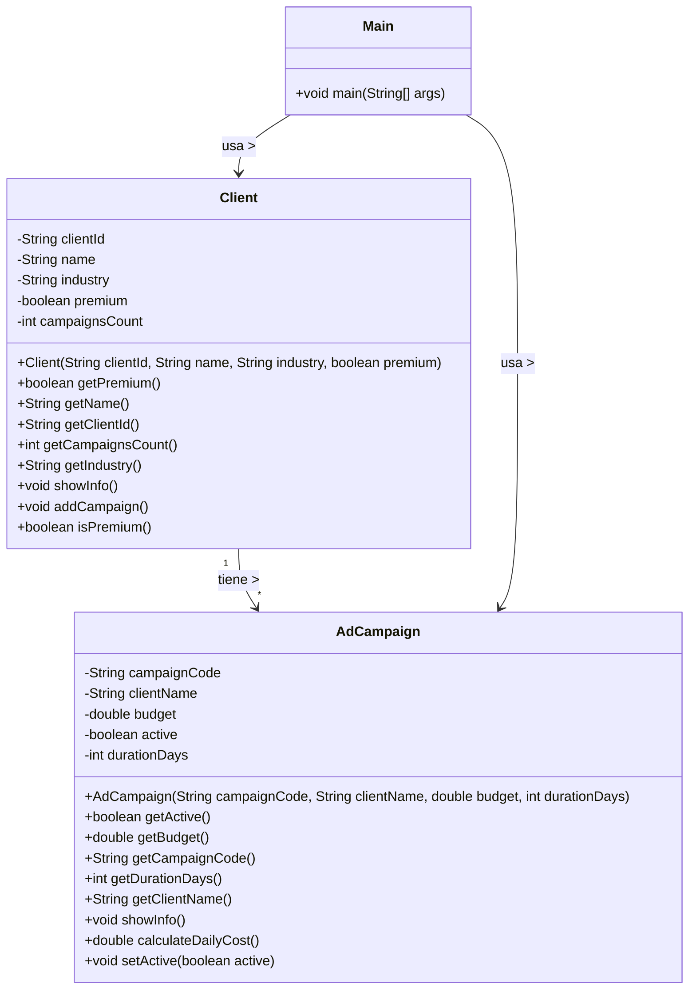

# Análisis del Dominio: Agencia de Marketing Digital

## 1. Identificación de Objetos

### Objeto Principal: Client
- **Justificación:** El cliente es la entidad central del negocio. Sin clientes no hay campañas ni ingresos para la agencia.
- **Atributos identificados:** clientId, name, industry, premium, campaignsCount
- **Comportamientos:** showInfo(), addCampaign(), isPremium(), getters

### Objeto Secundario: AdCampaign
- **Justificación:** Representa el servicio principal que ofrece la agencia: campañas publicitarias con presupuesto y duración definidos.
- **Relación con objeto principal:** Asociación 1 a muchos - Un cliente puede tener múltiples campañas. Se vinculan mediante clientName.

## 2. Diagrama de Clases

## 3. Decisiones de Diseño

- **¿Por qué elegí estos atributos?**
    - Client: IDs únicos para identificación, industry para segmentación, premium para diferenciar servicios, campaignsCount para métricas.
    - AdCampaign: Código único, presupuesto y duración esenciales para gestión financiera, active permite control de estado.

- **¿Qué validaciones implementé?**
    - Encapsulamiento con atributos private
    - Constructor obliga valores iniciales
    - campaignsCount inicia en 0 automáticamente

- **¿Qué relaciones identifiqué?**
    - Asociación Client → AdCampaign (1 a muchos) mediante clientName
    - Relación débilmente acoplada (usa String en lugar de referencia directa)

## 4. Dificultades Encontradas

- **Relación débil:** La vinculación por nombre (String) hace que si el nombre cambia, se pierda la conexión.
- **Contador manual:** campaignsCount no se actualiza automáticamente al crear campañas.
- **Falta validaciones:** No hay validación de datos negativos o nulos que podrían causar errores.