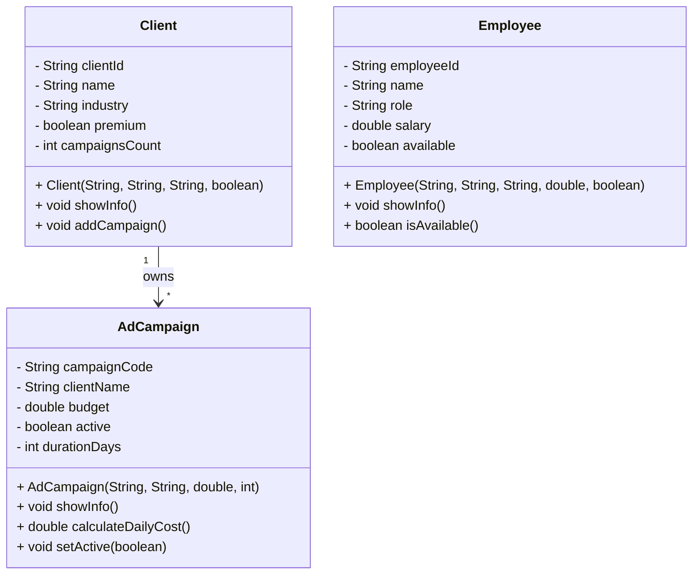

# Análisis del Dominio: Agencia de Publicidad (versión actualizada)

## 1. Identificación de Objetos

### Objeto Principal: `AdCampaign`

- **Justificación:**  
  Representa cada campaña publicitaria que gestiona la agencia.  
  Es el eje central del sistema, ya que toda la información de clientes, presupuestos y duración se relaciona con este objeto.

- **Atributos identificados:**
  - `campaignCode` → código identificador único de la campaña
  - `clientName` → nombre del cliente asociado
  - `budget` → presupuesto total de la campaña
  - `active` → estado de la campaña (activa o inactiva)
  - `durationDays` → duración de la campaña en días

- **Comportamientos:**
  - `showInfo()` → muestra toda la información de la campaña
  - `calculateDailyCost()` → calcula el costo diario de la campaña
  - `setActive(boolean)` → cambia el estado de la campaña

---

### Objeto Secundario: `Client`

- **Justificación:**  
  Representa a los clientes de la agencia que contratan campañas.  
  Sin clientes no existirían campañas.

- **Relación con el objeto principal:**  
  Un cliente puede tener varias campañas (`1:N`).

- **Atributos identificados:**
  - `clientId` → identificador único del cliente
  - `name` → nombre del cliente
  - `industry` → sector de la empresa
  - `premium` → indica si es cliente premium
  - `campaignsCount` → cantidad de campañas asociadas

- **Comportamientos:**
  - `showInfo()` → muestra la información del cliente
  - `addCampaign()` → incrementa el contador de campañas

---

### Objeto Secundario: `Employee`

- **Justificación:**  
  Representa a los empleados de la agencia que gestionan o supervisan campañas publicitarias.

- **Relación con el objeto principal:**  
  Aunque no se implementa explícitamente, un empleado puede estar asignado a múltiples campañas (`0:N`).

- **Atributos identificados:**
  - `employeeId` → identificador único del empleado
  - `name` → nombre del empleado
  - `role` → cargo o función dentro de la empresa
  - `salary` → salario del empleado
  - `available` → indica si el empleado está disponible

- **Comportamientos:**
  - `showInfo()` → muestra la información del empleado
  - `isAvailable()` → devuelve si está disponible

---

## 2. Diagrama de Clases

---
## 3. Decisiones de Diseño

**¿Por qué elegí estos atributos?**  
Los atributos representan la información esencial para administrar campañas, clientes y empleados.  
Se priorizó mantener el modelo simple pero funcional, centrado en los datos necesarios para el flujo del sistema.

**Validaciones implementadas:**  
- `AdCampaign` calcula el costo diario correctamente mediante `calculateDailyCost()`.  
- `Client` mantiene un contador de campañas coherente con `addCampaign()`.  
- `Employee` puede verificar su disponibilidad con `isAvailable()`.  

**Relaciones identificadas:**  
- Un `Client` puede tener múltiples `AdCampaign` (relación `1:N`).  
- Un `Employee` puede estar vinculado a múltiples campañas (relación conceptual `0:N`).  

---
## 4. Dificultades Encontradas

- Manejar la relación entre empleados y campañas sin aumentar la complejidad inicial.  
- Decidir qué información debía mostrarse en `showInfo()` para cada clase.  
- Mantener la consistencia entre las listas dinámicas (`ArrayList`) y los objetos creados.  
- Evitar la duplicación de datos entre arreglos y listas (ya solucionado en la versión actual).  
- Controlar excepciones de entrada del usuario al seleccionar opciones del menú.