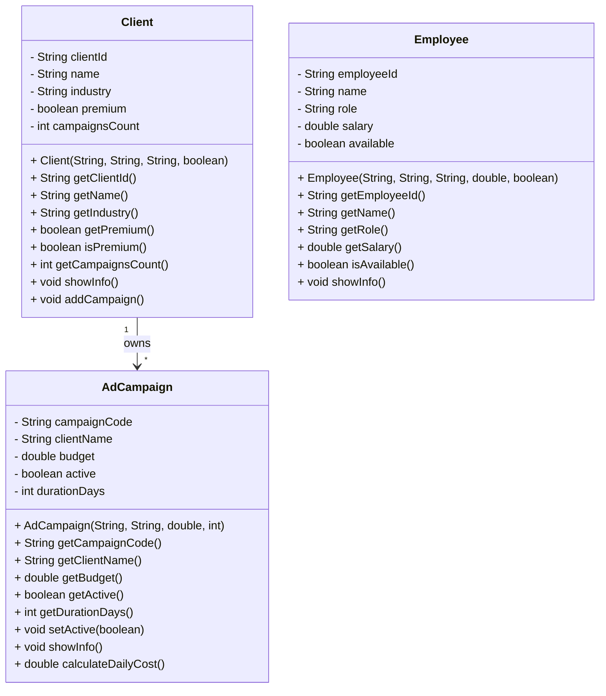

# Análisis del Dominio: Agencia de Publicidad

## 1. Identificación de Objetos

### Objeto Principal: `AdCampaign`
- **Justificación:** Representa cada campaña publicitaria que se gestiona para los clientes. Es el núcleo del sistema porque toda la información de presupuesto, duración y estado se relaciona directamente con este objeto.
- **Atributos identificados:** 
  - `campaignCode` → código identificador único de la campaña
  - `clientName` → nombre del cliente asociado
  - `budget` → presupuesto total de la campaña
  - `active` → estado de la campaña (activa o inactiva)
  - `durationDays` → duración de la campaña en días
- **Comportamientos:**  
  - `showInfo()` → Muestra la información completa de la campaña
  - `calculateDailyCost()` → Calcula el costo diario de la campaña
  - `setActive(boolean)` → Cambia el estado de la campaña

### Objeto Secundario: `Client`
- **Justificación:** Representa a los clientes que contratan campañas publicitarias. Sin clientes no existen campañas.
- **Relación con objeto principal:** Un cliente puede tener varias campañas (`1:N`).
- **Atributos identificados:**
  - `clientId` → identificador único del cliente
  - `name` → nombre del cliente
  - `industry` → sector al que pertenece
  - `premium` → indica si es cliente premium
  - `campaignsCount` → cantidad de campañas activas asociadas
- **Comportamientos:**  
  - `showInfo()` → Muestra la información del cliente
  - `addCampaign()` → Incrementa el contador de campañas

### Objeto Secundario: `Employee`
- **Justificación:** Representa a los empleados que gestionan campañas o realizan tareas relacionadas.
- **Relación con objeto principal:** Aunque no está explícitamente en el código, conceptualmente un empleado puede estar asignado a varias campañas (`0:N`).
- **Atributos identificados:**
  - `employeeId` → identificador único del empleado
  - `name` → nombre del empleado
  - `role` → cargo o función dentro de la empresa
  - `salary` → salario del empleado
  - `available` → indica si el empleado está disponible para nuevas tareas
- **Comportamientos:**
  - `showInfo()` → Muestra la información del empleado
  - `isAvailable()` → Devuelve si el empleado está disponible

## 2. Diagrama de Clases (opcional)

## 3. Decisiones de Diseño
- **¿Por qué elegí estos atributos?**
  - Los atributos elegidos representan la información esencial para gestionar campañas publicitarias, clientes y empleados.
  - En `AdCampaign` se incluyeron presupuesto, duración y estado para calcular costos diarios y controlar la actividad.
  - En `Client` se incluyen identificación, tipo de cliente y contador de campañas para gestionar relaciones.
  - En `Employee` se incluyen rol, salario y disponibilidad para poder asignar tareas de manera efectiva.

- **¿Qué validaciones implementé?**
  - Se controla que los métodos de `AdCampaign` calculen correctamente el costo diario (`calculateDailyCost()`).
  - Se verifica la disponibilidad de los empleados mediante `isAvailable()`.
  - Se mantiene un contador de campañas en `Client` para asegurar consistencia.

- **¿Qué relaciones identifiqué?**
  - Un `Client` puede tener varias `AdCampaign` (relación 1:N).
  - Conceptualmente, un `Employee` podría estar asignado a múltiples campañas (0:N), aunque no está implementado explícitamente.

## 4. Dificultades Encontradas
- Gestionar la relación entre `Employee` y `AdCampaign` sin sobrecomplicar la implementación inicial.
- Decidir qué información es esencial para mostrar en los métodos `showInfo()` sin sobrecargar la interfaz.
- Asegurar que el contador de campañas en `Client` se mantenga consistente cuando se agregan nuevas campañas.
- Manejar la protección de datos sensibles (como salarios y presupuestos) al generar logs o mostrar información.
