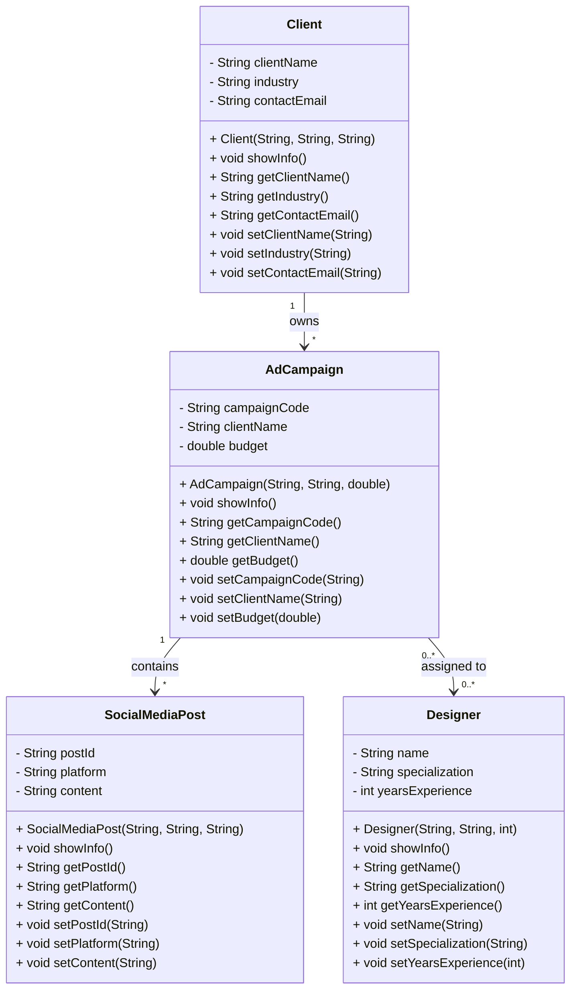

# Análisis del Dominio: Agencia de Publicidad (Versión Mejorada)

## 1. Identificación de Objetos

### Objeto Principal: `AdCampaign`

**Justificación:**
Representa cada campaña publicitaria que gestiona la agencia. Es el eje central del sistema, ya que toda la información de clientes y presupuestos se relaciona con este objeto.

**Atributos identificados:**
- `campaignCode` → código identificador único de la campaña
- `clientName` → nombre del cliente asociado
- `budget` → presupuesto total de la campaña en pesos

**Comportamientos:**
- `showInfo()` → muestra toda la información de la campaña
- Getters y Setters → acceso controlado a los atributos

---

### Objeto Secundario: `Client`

**Justificación:**
Representa a los clientes de la agencia que contratan campañas. Sin clientes no existirían campañas.

**Relación con el objeto principal:**
Un cliente puede tener varias campañas (relación `1:N`).

**Atributos identificados:**
- `clientName` → nombre del cliente
- `industry` → sector o industria de la empresa
- `contactEmail` → correo de contacto del cliente

**Comportamientos:**
- `showInfo()` → muestra la información del cliente
- Getters y Setters → acceso controlado a los atributos

---

### Objeto Secundario: `Designer`

**Justificación:**
Representa a los diseñadores que trabajan en las campañas. Son recursos clave para la ejecución de proyectos publicitarios.

**Relación con el objeto principal:**
Un diseñador puede trabajar en múltiples campañas (relación conceptual `0:N`).

**Atributos identificados:**
- `name` → nombre del diseñador
- `specialization` → área de especialidad (Branding, Gráficos, UX, etc.)
- `yearsExperience` → años de experiencia en el área

**Comportamientos:**
- `showInfo()` → muestra la información del diseñador
- Getters y Setters → acceso controlado a los atributos

---

### Objeto Secundario: `SocialMediaPost`

**Justificación:**
Representa los posts de redes sociales que se crean como parte de las campañas publicitarias. Son los activos digitales entregables.

**Relación con el objeto principal:**
Una campaña puede tener múltiples posts (relación `1:N`).

**Atributos identificados:**
- `postId` → identificador único del post
- `platform` → plataforma de redes sociales (Instagram, Facebook, TikTok, etc.)
- `content` → contenido o descripción del post

**Comportamientos:**
- `showInfo()` → muestra la información del post
- Getters y Setters → acceso controlado a los atributos

---

## 2. Diagrama de Clases Actualizado



---

## 3. Decisiones de Diseño

### ¿Por qué estos atributos?

Los atributos representan la información esencial para administrar campañas, clientes, diseñadores y contenido de redes sociales. Se priorizó mantener el modelo simple pero funcional, centrado en los datos necesarios para el flujo del sistema.

### Estructura de Clases

- **AdCampaign**: Contiene información básica de presupuesto y cliente
- **Client**: Almacena datos de contacto e industria
- **Designer**: Gestiona información de recursos humanos especializados
- **SocialMediaPost**: Representa los entregables digitales de las campañas

### Validaciones Implementadas

- Cada clase utiliza getters y setters para validar el acceso a sus atributos
- Los constructores inicializan todos los atributos necesarios
- El método `showInfo()` proporciona una representación legible de cada objeto

### Relaciones Identificadas

- Un `Client` puede tener múltiples `AdCampaign` (relación `1:N`)
- Una `AdCampaign` puede tener múltiples `SocialMediaPost` (relación `1:N`)
- Un `Designer` puede trabajar en múltiples `AdCampaign` (relación conceptual `0:N`)

---

## 4. Comparación con el Análisis Original

### Cambios Importantes

| Aspecto | Análisis Original | Versión Actual |
|--------|-------------------|-----------------|
| **Clases** | Client, AdCampaign, Employee | Client, AdCampaign, Designer, SocialMediaPost |
| **Atributos de AdCampaign** | campaignCode, clientName, budget, active, durationDays | campaignCode, clientName, budget |
| **Enfoque** | Gestión general de empleados | Especialización en diseño y redes sociales |
| **Complejidad** | Media (validaciones más complejas) | Baja (modelo simple y directo) |

### Ventajas de la Versión Actual

- Modelo más simple y enfocado
- Cada clase tiene una responsabilidad clara
- Mayor flexibilidad para agregar nuevas funcionalidades
- Mejor separación de responsabilidades

---

## 5. Flujo de Datos en Main

```
Main.java
    ├─→ AdCampaign("CAMP-001", "TechCorp", 15000000)
    │   └─→ showInfo() → "Campaña No.: CAMP-001 ..."
    │
    ├─→ Client("TechCorp", "Tecnología", "contacto@techcorp.co")
    │   └─→ showInfo() → "Cliente: TechCorp ..."
    │
    ├─→ Designer("Laura Gómez", "Branding", 5)
    │   └─→ showInfo() → "Diseñador: Laura Gómez ..."
    │
    └─→ SocialMediaPost("POST-1001", "Instagram", "Lanzamiento de nuevo producto")
        └─→ showInfo() → "Post ID: POST-1001 ..."
```

---

## 6. Dificultades Encontradas y Soluciones

| Dificultad | Solución |
|-----------|----------|
| Gestionar múltiples tipos de objetos sin exceso de complejidad | Se utilizó una estructura modular con clases independientes |
| Mantener la consistencia de datos entre objetos | Se implementaron getters y setters controlados |
| Decidir qué información mostrar en `showInfo()` | Se priorizó información esencial y legible |
| Relacionar diseñadores con campañas | Se dejó abierta la posibilidad de agregar listas de diseñadores en futuras versiones |
| Escalabilidad del sistema | Se diseñó con base en principios SOLID para facilitar expansión |

---

## 7. Mejoras Futuras Recomendadas

1. **Agregar colecciones**: Implementar `ArrayList` en `AdCampaign` para almacenar múltiples `SocialMediaPost` y `Designer`
2. **Métodos adicionales**: Agregar `calculateDailyCost()` en `AdCampaign` como en la propuesta original
3. **Persistencia**: Integrar base de datos para almacenar y recuperar información
4. **Validaciones**: Implementar excepciones personalizadas para entradas inválidas
5. **Reportes**: Crear métodos para generar reportes de campañas, presupuestos y desempeño

---

## 8. Ejemplo de Extensión: Agregar Métodos de Cálculo

```java
// Extensión de AdCampaign con métodos adicionales
public class AdCampaign {
    // ... atributos y constructores ...
    
    public double calculateDailyCost(int durationDays) {
        if (durationDays <= 0) {
            throw new IllegalArgumentException("Duración debe ser mayor a 0");
        }
        return budget / durationDays;
    }
    
    public double calculateMonthlyBudget() {
        return budget / 12;
    }
}
```

---

## Conclusión

Este análisis presenta un modelo orientado a objetos simple pero efectivo para una agencia de publicidad. La estructura actual facilita la gestión de campañas, clientes, diseñadores y contenido de redes sociales. El diseño modular permite agregar nuevas funcionalidades sin afectar las clases existentes, manteniendo los principios SOLID de desarrollo de software.