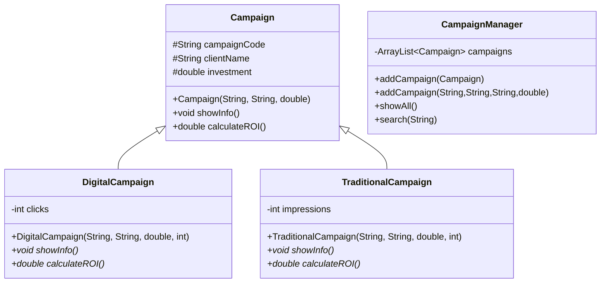

# 🧩 Semana 05 – Sobrecarga, Sobrescritura y Polimorfismo Dinámico
## 📘 Sistema Avanzado de Gestión de Campañas Publicitarias

Este proyecto amplía la jerarquía de la semana anterior incorporando conceptos avanzados de **POO**, tales como **sobrecarga de métodos**, **sobrescritura**, **polimorfismo dinámico**, y una **clase gestora** capaz de manejar cualquier tipo de campaña desde un único punto central.

Se demuestra cómo un mismo método puede comportarse de forma distinta dependiendo de los parámetros (**sobrecarga**) o de la clase concreta (**sobrescritura y polimorfismo dinámico**).

---

## 🎯 Objetivos

- [x] Implementar superclase `Campaign`
- [x] Crear subclases especializadas (`DigitalCampaign`, `TraditionalCampaign`)
- [x] Aplicar sobrescritura de métodos con `@Override`
- [x] Implementar polimorfismo dinámico en un `ArrayList<Campaign>`
- [x] Crear clase gestora con métodos sobrecargados (`CampaignManager`)
- [x] Documentar toda la jerarquía y su funcionamiento

---

## 📂 Archivos Entregados

- `src/Campaign.java` – Superclase
- `src/DigitalCampaign.java` – Subclase con sobrescritura
- `src/TraditionalCampaign.java` – Subclase con sobrescritura
- `src/CampaignManager.java` – Clase gestora con sobrecarga + polimorfismo
- `src/Main.java` – Demostración de uso
- `docs/README.md` – Documento que estás leyendo

---

## 📐 Diagrama de Clases UML

# 🏛️ Estructura de la Jerarquía
🟦 Superclase: Campaign

Define la estructura común:

Código de campaña

Cliente

Inversión

Cálculo base del ROI

Contiene el método general showInfo() que puede ser sobrescrito por las subclases.

🟩 Subclase: DigitalCampaign

Especializa campañas digitales agregando:

Cantidad de clicks

Sobrescribe:

@Override
void showInfo()

@Override
double calculateROI()

🟨 Subclase: TraditionalCampaign

Especializa campañas tradicionales agregando:

Cantidad de impresiones

Sobrescribe:

@Override
void showInfo()

@Override
double calculateROI()

# 🟪 Clase Gestora: CampaignManager

Implementa:

✔ Sobrecarga de métodos addCampaign()
addCampaign(Campaign c)
addCampaign(String type, String code, String client, double inv)

✔ Polimorfismo dinámico

Almacena:

ArrayList<Campaign> campaigns = new ArrayList<>();

Sin importar si son DigitalCampaign o TraditionalCampaign, se gestionan bajo el tipo Campaign.

# 🔄 Polimorfismo Implementado
✔ Polimorfismo por sobrescritura

Las subclases redefinen showInfo() y calculateROI().

✔ Polimorfismo dinámico
for (Campaign c : campaigns) {
c.showInfo();
c.calculateROI();
}

Cada objeto responde según su clase real, no según el tipo de referencia.

✔ Acceso a comportamientos específicos

Mediante instanceof cuando es necesario.

# 🚀 Ejecución
cd src
javac *.java
java Main

# 📌 Conceptos Aplicados

Herencia

Sobrecarga de métodos

Sobrescritura con @Override

Uso de super()

Polimorfismo dinámico

Clases gestoras

ArrayList polimórfico

Código extensible y reutilizable

# 🧩 Conclusión

Este sistema demuestra cómo integrar sobrecarga, sobrescritura y polimorfismo en un entorno de clases relacionadas.
Gracias a la clase gestora, el sistema se vuelve escalable y mantiene el principio OCP, permitiendo agregar nuevas campañas sin modificar el código existente.
