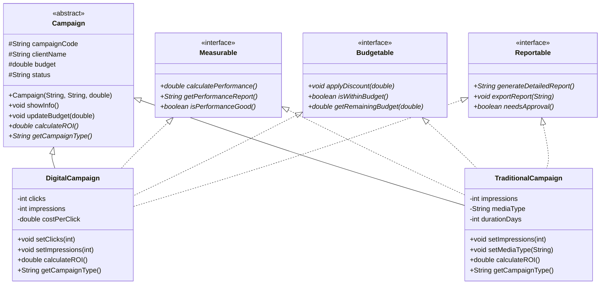

# 🧩 Semana 06 – Abstracción e Interfaces
## 📘 Sistema Avanzado de Gestión de Campañas Publicitarias

Este proyecto implementa **clases abstractas**, **interfaces** y **principios SOLID** para crear una arquitectura más flexible y extensible en el sistema de campañas publicitarias de "Creativa Digital".

---

## 🎯 Objetivos

- [x] Implementar clase abstracta `Campaign` con métodos abstractos y concretos
- [x] Crear interfaces especializadas (`Measurable`, `Budgetable`, `Reportable`)
- [x] Aplicar múltiple implementación de interfaces en clases concretas
- [x] Implementar polimorfismo avanzado con referencias a interfaces
- [x] Demostrar principios SOLID en el diseño
- [x] Crear sistema extensible y mantenible

---

## 📂 Archivos Entregados

- `abstractas/Campaign.java` – Clase abstracta base
- `interfaces/Measurable.java` – Interface para capacidades de medición
- `interfaces/Budgetable.java` – Interface para gestión de presupuestos
- `interfaces/Reportable.java` – Interface para generación de reportes
- `implementaciones/DigitalCampaign.java` – Implementación concreta para campañas digitales
- `implementaciones/TraditionalCampaign.java` – Implementación concreta para campañas tradicionales
- `Main.java` – Demostración completa del sistema
- `README.md` – Documentación del sistema
- `ANALISIS.md` – Análisis técnico de diseño

---

## 📐 Diagrama de Clases UML



# 🏛️ Estructura de la Jerarquía

## 🟦 Clase Abstracta: Campaign

**Define la estructura común:**
- Código de campaña
- Cliente
- Presupuesto
- Estado
- Cálculo base del ROI

**Contiene:**
- 2 métodos abstractos (`calculateROI()`, `getCampaignType()`)
- 3 métodos concretos (`showInfo()`, `updateBudget()`, getters/setters)
- Constructor base para inicialización común

---

## 🟩 Subclase: DigitalCampaign

**Especializa campañas digitales agregando:**
- Cantidad de clicks
- Impresiones digitales
- Costo por click

**Implementa interfaces:**
- `Measurable` - cálculo de CTR
- `Budgetable` - gestión de presupuesto digital
- `Reportable` - reportes específicos para digital

**Sobrescribe métodos abstractos:**
```java
@Override
double calculateROI()

@Override
String getCampaignType()
```

---

## 🟨 Subclase: TraditionalCampaign

**Especializa campañas tradicionales agregando:**
- Impresiones físicas
- Tipo de medio (TV, Radio, Prensa, Vallas)
- Duración en días

**Implementa interfaces:**
- `Measurable` - cálculo de CPM
- `Budgetable` - gestión de presupuesto tradicional
- `Reportable` - reportes específicos para tradicional

**Sobrescribe métodos abstractos:**
```java
@Override
double calculateROI()

@Override
String getCampaignType()
```

---

## 🟪 Interfaces Implementadas

### 📊 Measurable

Define capacidades de medición de performance:
- `calculatePerformance()` - Calcula métrica principal (CTR/CPM)
- `getPerformanceReport()` - Genera reporte de performance
- `isPerformanceGood()` - Evalúa si el performance es bueno

### 💰 Budgetable

Define capacidades de gestión de presupuesto:
- `applyDiscount(double)` - Aplica descuento al presupuesto
- `isWithinBudget()` - Verifica si está dentro del presupuesto
- `getRemainingBudget(double)` - Calcula presupuesto restante

### 📋 Reportable

Define capacidades de generación de reportes:
- `generateDetailedReport()` - Genera reporte detallado
- `exportReport(String)` - Exporta reporte en formato específico
- `needsApproval()` - Determina si necesita aprobación

---

## 🔄 Polimorfismo Implementado

### ✔ Polimorfismo por Clase Abstracta

```java
Campaign[] campaigns = new Campaign[4];
campaigns[0] = new DigitalCampaign(...);
campaigns[1] = new TraditionalCampaign(...);

for (Campaign campaign : campaigns) {
    campaign.showInfo(); // Comportamiento polimórfico
    campaign.calculateROI(); // Implementación específica
}
```

### ✔ Polimorfismo por Interfaces

```java
Measurable measurable = digitalCampaign;
System.out.println("Performance: " + measurable.calculatePerformance());

Budgetable budgetable = traditionalCampaign;
budgetable.applyDiscount(10.0);

Reportable reportable = digitalCampaign;
reportable.exportReport("PDF");
```

### ✔ Múltiple Implementación

Cada clase concreta implementa 3 interfaces simultáneamente, demostrando herencia múltiple a nivel de comportamiento.

---

## 🚀 Ejecución

```bash
# Compilar todo el proyecto
cd semana-06
javac abstractas/*.java interfaces/*.java implementaciones/*.java Main.java

# Ejecutar demostración
java Main
```

**Salida esperada:**

```text
=== AGENCIA CREATIVA DIGITAL - SISTEMA DE CAMPAÑAS ===

--- Sección 1: Polimorfismo con Campaign ---
=== Información de Campaña ===
Código: DIG-001
Cliente: TechCorp
Presupuesto: $15000000.0
Estado: Activa
Tipo: Campaña Digital
ROI: 66.67%
----------------------------
[... salida completa ...]
```

---

## 📌 Conceptos Aplicados

### 🏗️ Principios SOLID

- **SRP** - Cada interface tiene una única responsabilidad
- **OCP** - Sistema abierto para extensiones, cerrado para modificaciones
- **LSP** - Subclases sustituibles perfectamente por la clase base
- **ISP** - Interfaces segregadas y específicas
- **DIP** - Dependencias de abstracciones, no implementaciones

### 🔧 Técnicas Avanzadas

- Clases abstractas con métodos abstractos y concretos
- Múltiple implementación de interfaces
- Polimorfismo por tipo abstracto e interface
- Encapsulamiento con atributos protegidos
- Sobrescritura con `@Override`
- Métodos específicos por tipo de campaña

---

## 🧩 Conclusión

Este sistema demuestra cómo las clases abstractas e interfaces permiten crear arquitecturas flexibles y extensibles. Gracias a la separación de responsabilidades mediante interfaces, el sistema mantiene el principio OCP, permitiendo agregar nuevos tipos de campañas y capacidades sin modificar el código existente.

La implementación de múltiples interfaces proporciona una flexibilidad superior, permitiendo que diferentes tipos de campañas compartan capacidades comunes mientras mantienen su especialización específica.