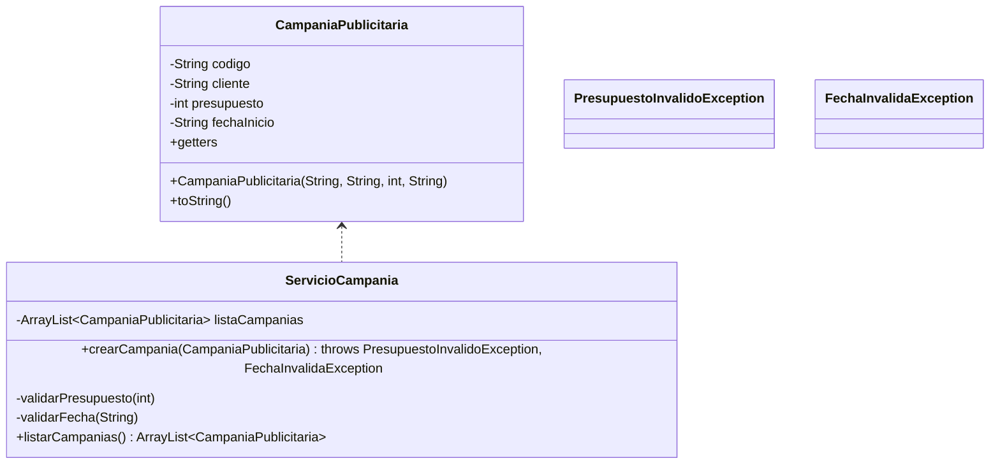

# 🧩 Semana 07 – Excepciones Personalizadas y Validaciones

## 📘 Sistema de Gestión de Campañas Publicitarias

Este proyecto implementa un sistema básico para registrar campañas publicitarias aplicando los conceptos de la Semana 07, especialmente:

* ✔ Validaciones obligatorias antes de registrar datos
* ✔ Lanzamiento de excepciones personalizadas (checked)
* ✔ Creación y manejo de un servicio con `ArrayList`
* ✔ Uso de `try/catch` en el `Main`
* ✔ Registro y prueba de campañas con datos válidos e inválidos

---

## 🎯 Objetivos de la Semana 07

* Crear un modelo básico con atributos
* Implementar dos excepciones personalizadas
* Crear un servicio con lista y método de creación con validaciones
* Manejar excepciones desde `Main` usando `try/catch`
* Realizar al menos 5 casos de prueba
* Usar paquete `org.example` y subpaquetes organizados

---

## 📂 Archivos Entregados

* `model/CampaniaPublicitaria.java` – Modelo
* `exceptions/PresupuestoInvalidoException.java` – Excepción personalizada
* `exceptions/FechaInvalidaException.java` – Excepción personalizada
* `services/ServicioCampania.java` – Servicio con validaciones
* `Main.java` – Ejecución con 5 casos de prueba

---

## 📐 Diagrama UML – Semana 07



---

## 🏛️ Componentes del Sistema

### 🟦 Modelo: CampaniaPublicitaria

Representa una campaña con:

* Código
* Cliente
* Presupuesto (debe ser mayor a 1000)
* Fecha de inicio (formato `YYYY-MM-DD`)

Incluye:

* Constructor
* Getters
* `toString()` para mostrar datos

---

### 🟥 Excepciones Personalizadas

#### 1. PresupuestoInvalidoException

Se lanza cuando el presupuesto es menor a 1000.

#### 2. FechaInvalidaException

Se lanza cuando la fecha NO cumple el formato requerido.

Ambas extienden de `Exception` → son checked exceptions.

---

### 🟩 Servicio: ServicioCampania

Funcionalidades principales:

#### ✔ `crearCampania(CampaniaPublicitaria)`

Valida:

* Presupuesto > 1000
* Fecha en formato válido

Si algo falla → lanza excepción personalizada.

#### ✔ `listarCampanias()`

Retorna lista de campañas registradas.

Uso de:

* Validaciones internas
* Manejo de ArrayList
* Separación clara del modelo

---

## 🔄 Casos de Prueba en Main (5 exigidos)

El `Main` realiza:

1. Registro exitoso
2. Error por presupuesto bajo
3. Error por formato de fecha
4. Registro exitoso
5. Impresión de campañas registradas

Todos los casos están envueltos en `try/catch` como exige la Semana 07.

---

## 🚀 Ejecución

### Compilar:

```bash
java -cp bin CreatividadDigital.Main

```

### Ejecutar:

```bash
java -cp bin CreatividadDigital.Main
```

---

## 📌 Conceptos Aplicados

* Excepciones personalizadas
* Validación de datos
* Uso de `throws` y `try/catch`
* Encapsulación
* Cohesión a través del servicio
* Patrón de responsabilidad única
* Manejo de listas con `ArrayList`
* Organización por paquetes (`model`, `services`, `exceptions`)

---

## 🧩 Conclusión

Este sistema cumple completamente los requerimientos de la Semana 07, aplicando validaciones y excepciones personalizadas para garantizar un registro seguro y controlado. La estructura modular permite escalar fácilmente el proyecto agregando más modelos, servicios o reglas de validación.